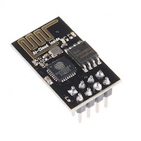
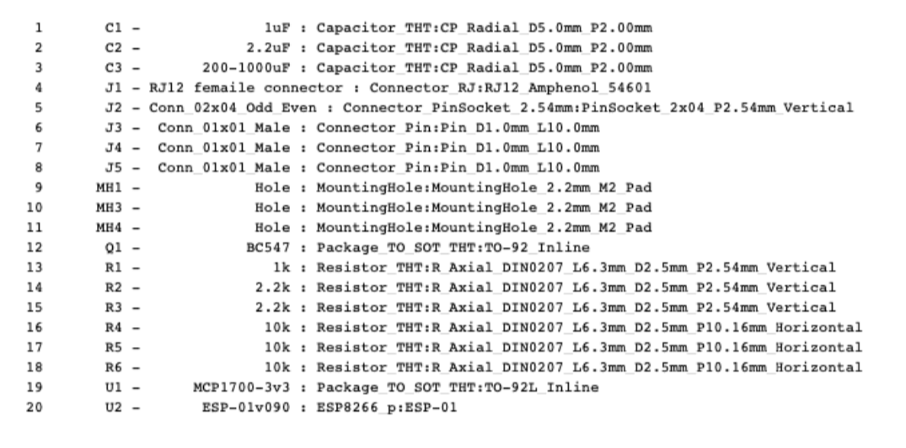

## Verschillen ESP-01

- ESP-01
- ESP-01 (Black Edition)
- ESP-01S

### ESP-01
De ESP-01 heeft slechts 512MB flash geheugen en is **niet** geschikt voor de DSMR-logger

### ESP-01 (Black Edition)
Dit is de versie van de ESP8266 waar versie 2 en 3 van de DSMR-logger op zijn gebaseerd. 
Deze versie heeft een `rode` power led en een `blauwe` led die op GPIO-01 is 
aangesloten.   
Deze versie heeft `1MB` flash geheugen en is geschikt voor de DSMRlogger2HTTP firmware.

### ESP-01S
Oorspronkelijk had deze ESP-01 ook slecht `512MB` flash geheugen.   
De versie die nu meestal verkocht wordt heeft echter `1MB` geheugen. 
Het is dus wel zaak op te letten wat voor versie je koopt!
De ESP-01S heeft geen power led en de `blauwe led` is niet op GPIO-01 maar op GPIO-02 
aangesloten.  
Deze versie van de ESP-01 is geschikt voor de DSMRlogger2HTTP firmware.

 

---

[BOM] 

